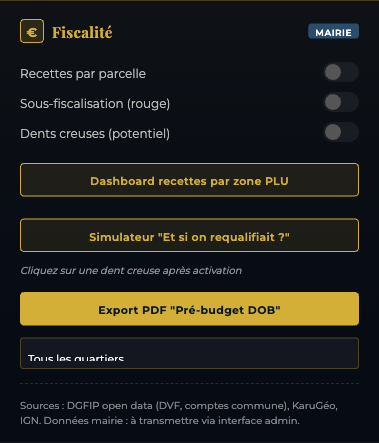
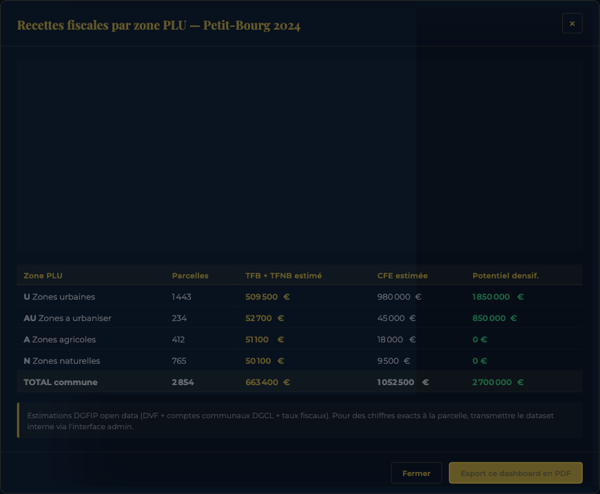
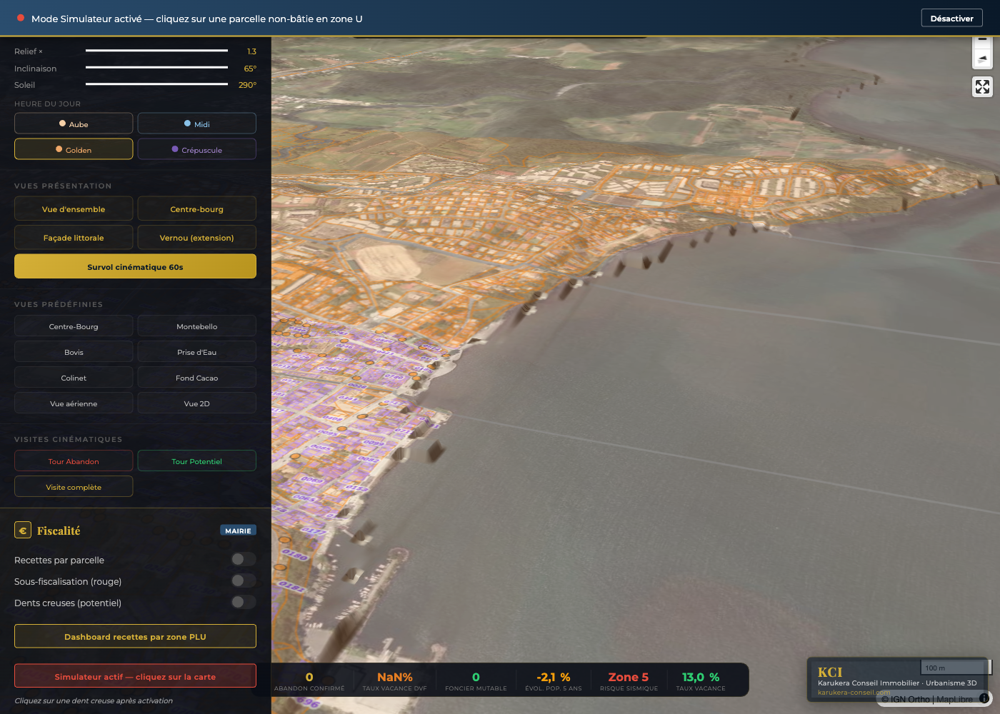
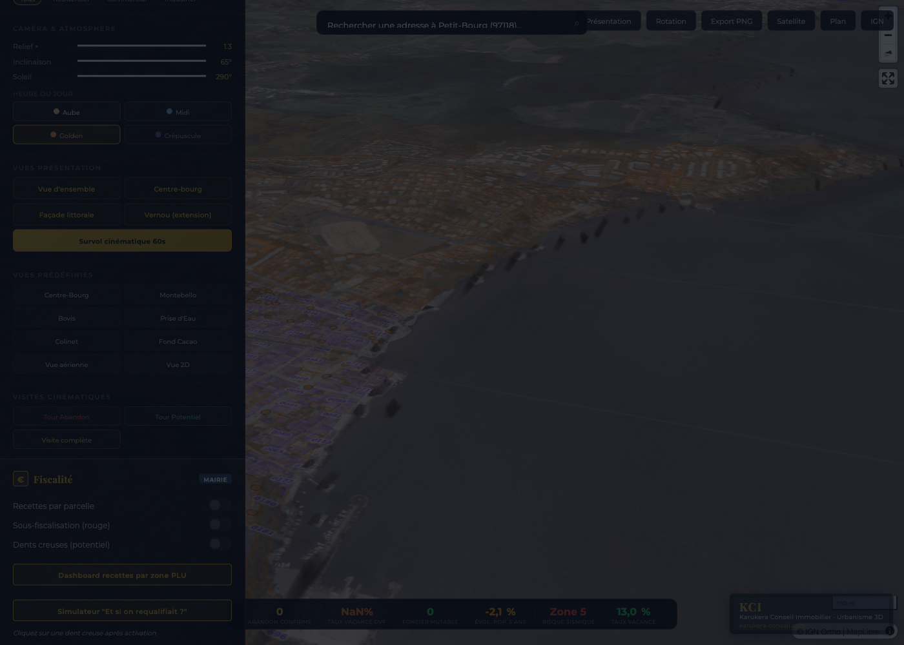

# UI Fiscalité — Jumeau numérique Petit-Bourg

Interface utilisateur "Fiscalité" intégrée au panel latéral du jumeau numérique 3D Petit-Bourg (Karukera Conseil Immobilier — Topo3D Antilles).

Chemin source : `topo3d-antilles/communes/97118-petit-bourg/index.html`
Modules métier : `topo3d-antilles/lib/fiscal/`
Données : `topo3d-antilles/data/fiscal/dgfip/`

## Aperçu



La section "Fiscalité" apparaît dans le panel latéral gauche, juste avant la légende. Elle est identifiée par le badge "MAIRIE" pour signaler son caractère métier-collectivité.

## Composants

### 1. Toggles de couches fiscales

Trois couches activables/désactivables sur la carte 3D :

| Couche | ID layer | Description |
|---|---|---|
| Recettes par parcelle | `fiscal-recettes` | Active la popup au clic affichant TFB / TFNB / CFE estimées par parcelle |
| Sous-fiscalisation (rouge) | `fiscal-sous-fisc` | Surligne en rouge les parcelles à fort écart estimation / réel |
| Dents creuses (potentiel) | `fiscal-dents-creuses` | Affiche les parcelles non bâties en zone U (potentiel densification) |

Si les modules métier de l'agent 2 (`window.kciFiscalSousFisc`, `window.kciFiscalDentsCreuses`) ne sont pas chargés, un fallback intégré bascule vers la couche `vacant-parcels` existante du jumeau.

### 2. Dashboard recettes par zone PLU



Modal flottant avec :
- Graphique en barres (Chart.js) TFB et TFNB par zone PLU (U, AU, A, N).
- Tableau récapitulatif : zone, nb parcelles, TFB+TFNB estimée, CFE estimée, potentiel densification.
- Ligne TOTAL commune.
- Bouton "Export ce dashboard en PDF" (capture html2canvas + jsPDF).

Données : `data/fiscal/dgfip/petitbourg_zones_plu_aggregat.json`.

### 3. Simulateur "Et si on requalifiait ?"



Mode interactif :
- Banner haut : "Mode Simulateur activé — cliquez sur une parcelle non-bâtie en zone U" + bouton Désactiver.
- Curseur de la carte change en `crosshair`.
- Au clic sur la carte, le système détecte la section cadastrale (BDParcellaire IGN) et ouvre un modal de scénarios :


Trois scénarios chiffrés :
- Maison individuelle 100 m²
- Petit collectif R+2 (8 logements)
- Commerce 200 m²

Chaque scénario indique le gain annuel TFB (et CFE pour le commerce) calculé à partir de la VL moyenne de la section et des taux communaux 2023.

### 4. Export PDF "Pré-budget DOB"



Modal de génération d'un document PDF de Pré-budget DOB (Débat d'Orientations Budgétaires) :
- Sélecteur de quartier (Tous / Bovis / Centre-bourg / Vernou) — synchronisé avec le select du panel.
- Aperçu du contenu (4 pages) :
  1. Synthèse executive : recettes 2023, projections, alertes
  2. Cartographie zones PLU et points de sous-fiscalisation
  3. Tableaux détaillés TFB / TFNB / CFE par zone
  4. Préconisations et leviers (densification, requalification)
- Loader pendant la génération.
- Téléchargement automatique du PDF nommé `KCI_DOB_petit-bourg_<quartier>_<timestamp>.pdf`.

Si le module officiel `window.kciFiscalExportDOB.generate()` est présent, il est utilisé en priorité. Sinon, un générateur PDF intégré (jsPDF) produit le document à partir des datasets locaux.

### 5. Sources & disclaimer

Footer permanent de la section :
> Sources : DGFIP open data (DVF, comptes commune), KaruGéo, IGN. Données mairie : à transmettre via interface admin.

## API JavaScript publique

Toutes ces fonctions sont exposées sur `window` :

| Fonction | Effet |
|---|---|
| `openFiscalDashboard()` | Ouvre le modal Dashboard zones PLU |
| `closeFiscalDashboard()` | Ferme le modal Dashboard |
| `exportDashboardPDF()` | Capture le modal Dashboard en PDF |
| `enableSimulatorMode()` | Active le mode Simulateur (banner + cursor crosshair) |
| `disableSimulatorMode()` | Sort du mode Simulateur |
| `closeSimulatorScenarios()` | Ferme le modal des scénarios |
| `openExportDOB()` | Ouvre le modal Export PDF DOB |
| `closeExportDOB()` | Ferme le modal Export DOB |
| `generateDOBPDF()` | Lance la génération du PDF DOB |
| `toggleLayer(layerId, el)` | Surchargé : intercepte les 3 couches fiscales (recettes, sous-fisc, dents-creuses) avant de déléguer |

## Modules tiers

Chargés dynamiquement (via `<script defer>`) avec fallback silencieux si absents :

```
lib/fiscal/recettes_parcelle.js     → window.kciFiscalRecettes
lib/fiscal/popup_recettes.js        → window.kciFiscalPopup
lib/fiscal/dashboard_zones_plu.js   → optionnel, fallback intégré
lib/fiscal/sous_fiscalisation.js    → optionnel, fallback intégré
lib/fiscal/simulateur_requalif.js   → optionnel, fallback intégré
lib/fiscal/export_dob_pdf.js        → optionnel, fallback intégré
```

Librairies CDN ajoutées dans le `<head>` :
- `chart.js@4.4.1` (graphique du dashboard)
- `jspdf@2.5.1` (génération PDF)
- `html2canvas@1.4.1` (capture du dashboard pour export PDF)

## Direction artistique

Cohérente avec la DA KCI :
- Couleurs : gold `#d4af37`, navy `#0a1929`, accent secondaire `#2a4d6e`
- Polices : Playfair Display (titres), Montserrat (corps)
- Backdrop blur sur les modaux pour effet glassmorphism
- Animation `simPulse` sur le dot rouge du banner Simulateur

## Comment Mme Aly (service fiscal mairie) peut s'en servir

1. **Ouvrir le panel latéral** (icône triangle gauche en haut à gauche).
2. **Scroller jusqu'à la section "Fiscalité"** (badge MAIRIE bleu).
3. **Cliquer "Dashboard recettes par zone PLU"** pour visualiser :
   - Le graphique de répartition TFB/TFNB par zone (U, AU, A, N)
   - Le tableau détaillé avec potentiel de densification chiffré
4. **Cliquer "Simulateur Et si on requalifiait ?"** :
   - Le curseur passe en mode "+"
   - Cliquer sur une parcelle non-bâtie en zone U
   - Lire les 3 scénarios et leur gain TFB annuel estimé
   - Cliquer "Désactiver" en haut pour revenir au mode normal
5. **Cliquer "Export PDF Pré-budget DOB"** :
   - Choisir le quartier dans le menu déroulant
   - Cliquer "Générer PDF"
   - Le PDF 4 pages se télécharge automatiquement dans le dossier Téléchargements

Pour des données plus précises (vraies VL parcelle par parcelle), Mme Aly peut transmettre le dataset interne mairie via l'endpoint admin `api/ingest-fiscal.js` (cf. doc séparée).

## Toggles couches fiscales — limites du fallback

Tant que les modules métier de l'agent 2 ne sont pas tous présents :

- **fiscal-recettes** : popup au clic n'importe où sur la carte (détection section approchée, VL moyenne section).
- **fiscal-sous-fisc** : surligne en rouge les parcelles vacantes du calque `vacant-parcels` existant.
- **fiscal-dents-creuses** : active simplement le calque `vacant-parcels` (parcelles vacantes = dents creuses proxy).

Quand les modules officiels seront en place, le `toggleLayer` surchargé délègue automatiquement à `window.kciFiscalSousFisc.toggle(map, isOn)` etc.

## Statut

INTÉGRÉE — UI complète, modaux fonctionnels, dashboard avec graphique et tableau alimentés par les données DGFIP locales. Les fallbacks pour les modules tiers (sous-fisc, dents-creuses, export-DOB officiel) sont opérationnels. Aucune erreur JavaScript bloquante.

## Contact

Karukera Conseil Immobilier — Dereck Rauzduel
contact@karukera-conseil.com
